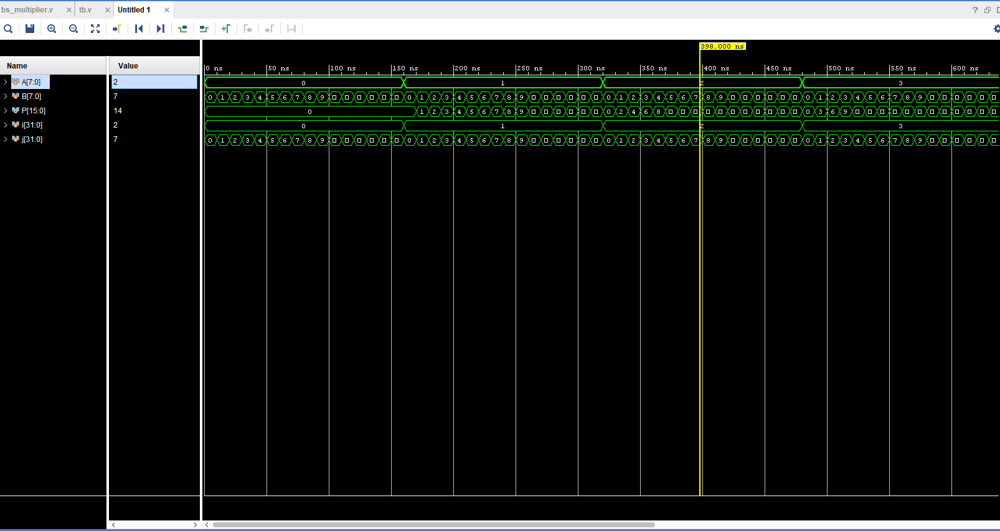
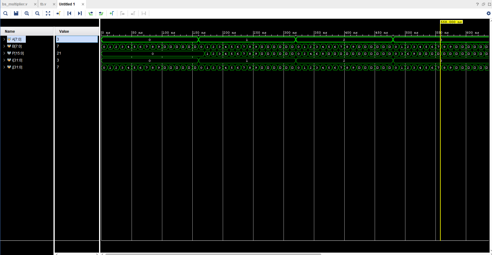
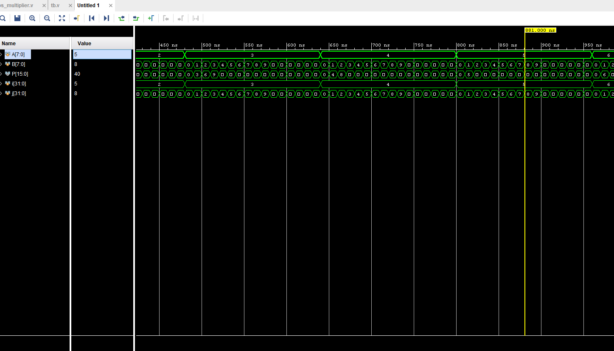
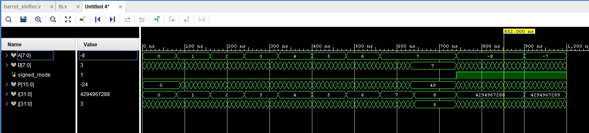

# 8-bit-barrel-shifter-based-Multiplier
8-bit barrel shifter implementation using multiplexers
# ⚙️ 8-Bit Barrel Shifter Based Multiplier

## 🧩 Overview
A **barrel shifter–based multiplier** is a high-speed digital multiplier that utilizes a **barrel shifter** to perform rapid shift operations in a single clock cycle.  
Unlike traditional shift-and-add multipliers that require multiple clock cycles for each shift, the barrel shifter performs **parallel shifting**, leading to significant improvement in speed and efficiency.

This project focuses on the **design and FPGA implementation of an 8-bit barrel shifter–based multiplier** using **Verilog HDL**.

---

## 🔹 Introduction
Multiplication is a fundamental arithmetic operation in digital systems and is widely used in:
- Digital Signal Processing (DSP)
- Control systems
- Image processing
- Arithmetic Logic Units (ALUs)

In hardware design, multipliers can be implemented using several techniques such as:
- Serial shift-and-add multiplication  
- Array (parallel) multiplication  
- Booth multiplication  
- Wallace tree multiplication  

While efficient, these traditional methods still require multiple clock cycles for bit shifting.  
To overcome this, the **barrel shifter** is introduced — a combinational circuit capable of performing all shifts **in one step**, resulting in **higher speed and lower latency**.

---

## 🔹 What is a Barrel Shifter?
A **barrel shifter** is a combinational circuit that can shift or rotate data by a specified number of bit positions **in a single clock cycle**.  
It is typically implemented using multiplexers to achieve simultaneous multi-bit shifting.

For an 8-bit input, the barrel shifter can shift data left or right by 0–7 bit positions based on control signals.

**Key Advantage:**  
Traditional shifters shift one bit per cycle, while a barrel shifter performs all shifts in parallel, enabling **instantaneous shift operations**.

---

## 🔹 Working Principle

Let the two 8-bit numbers be:

- **A (Multiplicand)** → 8 bits  
- **B (Multiplier)** → 8 bits  

### Step 1: Partial Product Generation
Each bit of the multiplier (B) is ANDed with all bits of the multiplicand (A), generating eight **partial products**.

\[
PP_i = A \text{ AND } B_i \quad \text{for } i = 0 \text{ to } 7
\]

### Step 2: Barrel Shifting
Each partial product is shifted left according to the bit position of the corresponding multiplier bit.  
The barrel shifter performs all shifts **in parallel**.

Example:
- If \( B_0 = 1 \): use \( A \times 2^0 \) (no shift)  
- If \( B_1 = 1 \): use \( A \times 2^1 \) (shift left by 1)  
- If \( B_2 = 1 \): use \( A \times 2^2 \) (shift left by 2), etc.

### Step 3: Addition of Partial Products
All the shifted partial products are then added using a network of adders (Ripple Carry or Carry-Save Adder).

\[
Product = \sum_{i=0}^{7} (PP_i \times 2^i)
\]

### Step 4: Final Output
The result is a **16-bit product** representing \( A \times B \).

---

## Simulation Results

Below are the waveform simulation outputs from the testbench of the Booth multiplier.

### Case 1

### Case 2

### Case 3

### CASE 4

### CASE 5

## 🔹 Block Diagram

         +-----------------------------+
 A[7:0] →|  AND Array + Barrel Shifter |→ Partial Products
         +-----------------------------+
                        |
                        v
               +------------------+
               |  Adder Network   |
               +------------------+
                        |
                        v
                 16-bit Product (P[15:0])

         ---

## 🔹 Design Flow
1. **Specification:**  
   Define inputs and outputs (8-bit A, 8-bit B, 16-bit product P).

2. **Behavioral Design:**  
   Write Verilog modules for:
   - AND array  
   - Barrel shifter  
   - Adder network  

3. **Simulation:**  
   Verify functionality using a Verilog testbench in **ModelSim**, **Vivado**, or **ISim**.

4. **Synthesis and Implementation:**  
   Synthesize and implement the design using **Xilinx Vivado** or **ISE** for an FPGA such as the **ZedBoard Zynq-7000**.

5. **Hardware Testing:**  
   Generate the bitstream, program the FPGA, and verify results through LEDs, switches, or UART output.

---

## 🔹 Advantages
✅ Single-cycle shift operation  
✅ High-speed multiplication  
✅ Reduced propagation delay  
✅ Low hardware complexity  
✅ Efficient FPGA resource utilization  
✅ Suitable for pipelined or parallel architectures  

---

## 🔹 Applications
- Digital Signal Processing (DSP)  
- Image and video processing  
- Arithmetic Logic Units (ALUs)  
- Embedded FPGA systems  
- Control systems requiring fast arithmetic operations  

---

## 🔹 Conclusion
The **8-bit barrel shifter–based multiplier** provides an efficient and high-speed solution for digital multiplication.  
By incorporating a barrel shifter, all shift operations are completed in a single clock cycle, drastically improving overall speed compared to traditional shift-and-add multipliers.  
This makes it an ideal design for **FPGA and VLSI implementations** where timing and area efficiency are crucial.

---

## 🔹 Future Enhancements
- Implement signed multiplication (2’s complement)  
- Extend design to 16-bit or 32-bit operations  
- Integrate pipeline stages for higher throughput  
- Combine with **Booth encoding** for further optimization  

---

## 🔹 Tools Used
- **HDL Language:** Verilog  
- **Simulation Tool:** Xilinx Vivado / ModelSim  
- **Target Device:** ZedBoard Zynq Evaluation and Development Kit  
- **Programming Language:** Verilog HDL  
- **Design Type:** Combinational + Sequential logic  

---

## 🧠 Author
**Project Title:** 8-Bit Barrel Shifter Based Multiplier  
**Institution:** [INDIAN INSTITUTE OF INFORMATION TECHNOLOGY DESIGN AND MANUFACTURING KURNOOL]  
**Year:** 2025  

---

